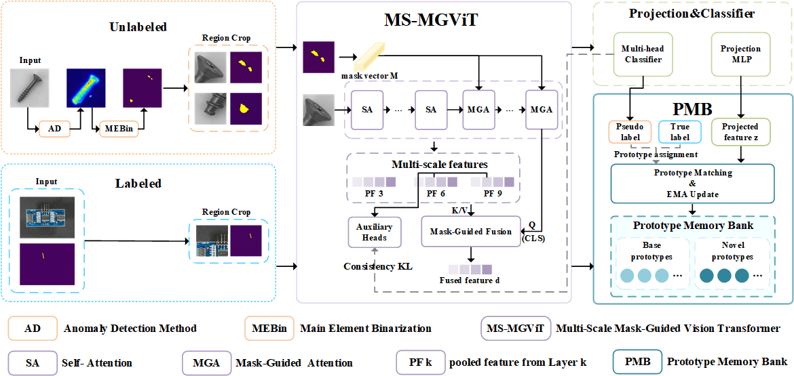

# Multi-Scale Mask-Guided Prototype Learning for Novel Defect Class Discovery

This repository contains the public implementation materials for the paper:

> **Multi-Scale Mask-Guided Prototype Learning for Novel Defect Class Discovery in Industrial Visual Inspection**

The project studies **industrial anomaly novel class discovery**, where labeled known-class defects and unlabeled target-domain defects are jointly used to organize previously unseen defect categories.

<p align="center">
  
</p>

## Method Overview

The proposed framework contains three main components:

- **MS-MGViT**: a multi-scale mask-guided Vision Transformer for fine-grained anomaly-region representation.
- **PMB**: a prototype memory bank that maintains stable known- and novel-class prototypes using momentum updates.
- **CARM**: a confidence-aware region merging strategy that fuses region-level predictions using multiple reliability cues.

The experiments are conducted on **MVTec AD** and **MTD**, with **AeBAD-S** used as the labeled known-class dataset.

## Release Status

This repository is currently a **partial release for peer review**.

| Component | Current status |
|---|---|
| Dataset preprocessing | Available |
| MEBin region generation | Available |
| Basic training and evaluation framework | Available |
| MS-MGViT core implementation | Temporarily withheld |
| PMB update and prototype-loss implementation | Temporarily withheld |
| CARM reliability scoring and fusion implementation | Temporarily withheld |
| Complete training configuration | Temporarily withheld |
| Pretrained checkpoints | Temporarily withheld |

The complete implementations, configurations, and checkpoints will be released after the peer-review process. The current public snapshot is therefore **not intended to exactly reproduce all results reported in the manuscript**.

## Repository Structure

```text
.
├── assets/
│   └── pipeline.png
├── configs/
│   └── public_example.yaml
├── datasets/
│   ├── aebad_preprocess.py
│   ├── mtd_preprocess.py
│   ├── data_utils.py
│   ├── dataset.py
│   └── transform.py
├── examples/
│   └── anomalyncd_main.py
├── models/
│   ├── modules/
│   │   ├── _MEBin.py
│   │   └── _classifier.py
│   └── loss/
│       ├── _contrastive_loss.py
│       └── _distill_loss.py
├── scripts/
│   ├── anomalyncd.sh
│   └── anomalyncd_test.sh
├── utils/
├── LICENSE
└── README.md
```

The directory structure above corresponds to the recommended public version. Core implementation files that are temporarily withheld should not be included in the review-stage repository.

## Environment

A reference environment is:

- Ubuntu 20.04 or later
- Python 3.8
- PyTorch 2.0.0
- CUDA 11.8

Create an environment:

```bash
conda create -n anomalyncd python=3.8 -y
conda activate anomalyncd
```

Install PyTorch and the required packages:

```bash
pip install torch==2.0.0 torchvision==0.15.1 \
  --index-url https://download.pytorch.org/whl/cu118

pip install numpy scipy scikit-learn opencv-python pillow \
  tqdm pyyaml loguru matplotlib
```

Different PyTorch or CUDA versions may also work, but they have not been systematically tested in the current public snapshot.

## Dataset Preparation

The datasets are not redistributed in this repository. Please download them from their official sources and follow their respective licenses.

### 1. MVTec AD

Organize the original dataset as:

```text
data/mvtec_anomaly_detection/
├── bottle/
├── cable/
├── capsule/
├── ...
└── zipper/
```

The method requires anomaly maps generated by an external anomaly detector. A recommended path is:

```text
data/mvtec_musc_anomaly_map/
```

After MEBin-based region extraction, the processed data should follow:

```text
data/mvtec_musc_crop/
└── <category>/
    ├── images/
    │   └── <defect_type>/*.png
    └── masks/
        └── <defect_type>/*.png
```

### 2. MTD

Edit the paths at the bottom of `datasets/mtd_preprocess.py`, and then run:

```bash
python datasets/mtd_preprocess.py
```

The converted dataset is expected at:

```text
data/mtd_anomaly_detection/
├── train/
├── test/
└── ground_truth/
```

Prepare the corresponding anomaly maps under:

```text
data/mtd_musc_anomaly_map/
```

### 3. AeBAD-S

AeBAD-S is used as the labeled known-class dataset. Edit the paths in `datasets/aebad_preprocess.py`, and run:

```bash
python datasets/aebad_preprocess.py
```

The processed data should follow:

```text
data/AeBAD_crop/
├── images/
│   └── <defect_type>/*.png
└── masks/
    └── <defect_type>/*.png
```

## Configuration

The public repository provides an example configuration file:

```text
configs/public_example.yaml
```

It contains the general preprocessing and training settings. Exact configurations of MS-MGViT, PMB, the consistency objective, and CARM are intentionally omitted during peer review.

Example:

```yaml
binarization:
  sample_rate: 4
  min_interval_len: 4
  erode: true

models:
  pretrained_backbone: dino_vitb8
  n_views: 2
  n_head: 4
  use_ms_mgvit: true

training:
  batch_size: 48
  num_workers: 8
  lr: 0.003
  weight_decay: 0.00005
  epochs: 50

method:
  use_pmb: true
  use_carm: true

# Detailed settings will be released after peer review.
```

Do not use fabricated placeholder values for omitted parameters. Use `null` or comments to indicate that a configuration is unavailable.

## Usage

### Data preprocessing

Prepare the datasets and anomaly maps first, and then adjust the paths in:

```text
scripts/anomalyncd.sh
```

### Training

The complete proposed model depends on modules that are temporarily withheld. Full training and reproduction commands will be enabled when the complete implementation is released.

The intended command format is:

```bash
bash scripts/anomalyncd.sh
```

### Evaluation

After the complete release, a trained checkpoint can be evaluated using:

```bash
bash scripts/anomalyncd_test.sh
```

Before running the script, replace all local absolute paths with repository-relative paths, for example:

```bash
checkpoint_dir="outputs/checkpoints"
```

## Reported Results

The following results are reported in the manuscript:

| Dataset | NMI | ARI | F1 |
|---|---:|---:|---:|
| MVTec AD | 0.634 | 0.551 | 0.737 |
| MTD | 0.273 | 0.228 | 0.511 |

These values correspond to the complete implementation of MS-MGViT, PMB, and CARM. Exact reproduction requires the full configuration and code that will be released after peer review.

## Reproducibility Notice

The review-stage repository is intended to provide:

- the data preparation procedure;
- the baseline project structure;
- public preprocessing and evaluation utilities;
- a transparent description of the release scope.

It does not currently provide enough information to reproduce the complete proposed method. This limitation is stated explicitly to avoid presenting a partial implementation as a complete reproducibility package.

## Citation

Citation information will be added after the manuscript is accepted or publicly available.

## Acknowledgements

This project is developed on top of the AnomalyNCD codebase and uses a DINO-pretrained Vision Transformer backbone. Please cite the corresponding original works when using this repository.

The repository also uses the publicly available MVTec AD, MTD, and AeBAD datasets. Please follow the original dataset licenses and citation requirements.
